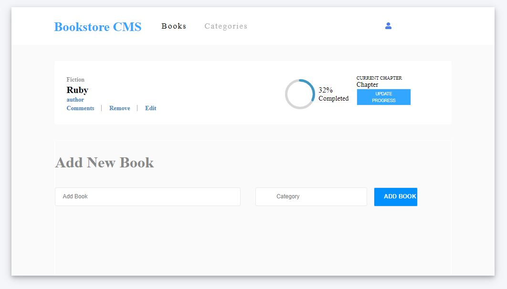

# Book Store

> Implementation of ReactJS and Redux to build book store.

Additional description about the project and its features.

## Built With

- Major languages: ReactJS, Redux
- Frameworks: Babel, Webpack, Flexbox
- Technologies used: Javascript

## Getting Started

To get a local copy up and running follow these simple example steps.

## Prerequisites
- A working Laptop or Desktop
## Setup
- Install code editor
- Install Git bash
- Create react app
- Install react-redux

## Install

- clone the [math magicians](git@github.com:Emmy-github-webdev/bookstore-react-redux.git).

## Usage
- Test your GitHub flow, a linter and professional documentation ability
## Run tests
- Run npm start to run the project
## Deployment
- Deploy to either [Heroku](https://www.heroku.com/) or [Netlify](https://www.netlify.com/),

## Dependencies

- redux 
- react-redux 
- redux-thunk 
- redux-devtools-extension
- react-router-dom

# Authors
👤 **Emmanuel Oga**
- GitHub: [Emmy-github-webdev](https://github.com/Emmy-github-webdev)
- Twitter: [@ogaemmanuel](https://twitter.com/OgaemmanuelOga).
- LinkedIn: [@ogaemmanuel](https://www.linkedin.com/in/emmanuel-oga-16171584/)

## 🤝 Contributing

Contributions, issues, and feature requests are welcome!

Feel free to check the [issues page](https://github.com/Emmy-github-webdev/bookstore-react-redux/issues).

## Show your support

Give a ⭐️ if you like this project!

## Acknowledgments

- Hat tip to anyone whose code was used
- Inspiration
- etc

## 📝 License

This project is [MIT](./MIT.md) licensed.
